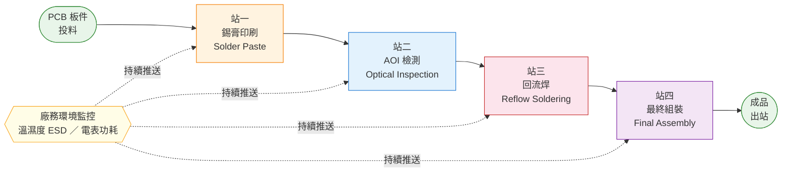

# PRD-001：製程情境與業務需求

> 版本：v0.2
> 日期：2026-08-07
> 狀態：定稿

---

## 1. 情境背景

### 1.1 產品定位

**willThx** 是一套面向製造業的 IoT SaaS 平台，主要客戶為 PCB 製造與加工端（如 HP、聯想、ASUS 等）。

平台核心價值：
- 提供 Web 介面讓客戶自助設定製程、機台、IoT 元件
- 即時收集設備感測資料（Telemetry）與製程事件（Event）
- 提供即時監控、異常告警、資料查詢與追溯功能

**本文件以一座 SMT（表面黏著技術）電子製造廠作為 Demo 情境**，模擬真實客戶的使用場景，用於驗證平台功能與百萬流量等級下的系統穩定性。

### 1.2 平台與工廠的對應關係

一個 willThx 租戶（Tenant）對應一座工廠，工廠內的靜態設定層級如下：

```
Tenant（工廠）
 └── Station（製程站點）              e.g., 錫膏印刷、AOI 檢測
      ├── IoT Component（站點層級）   e.g., 站區溫濕度感測器、電表
      │    ├── 資料類型（Telemetry / Event / Command）
      │    ├── 單位（°C / % / kWh）
      │    └── 上報頻率
      └── Machine（機台）             e.g., 印刷機 #1、印刷機 #2
           └── IoT Component（機台層級）  e.g., 刮刀壓力感測器
                ├── 資料類型（Telemetry / Event / Command）
                ├── 單位（kgf / mm / mm/s）
                └── 上報頻率
```

流動資料實體（不屬於靜態設定層）：

```
Lot（批號）  ── 屬於哪條產線、包含哪些 Unit
Unit（板件） ── unitSerial，記錄跨站的所有事件與感測數值
```

---

## 2. 生產流程

### 2.0 製程全覽



### 2.1 批號制度

工廠以**批號（Lot）**為單位進行生產管理。每個批號包含數量固定的板件，每片板件擁有唯一識別碼（unitSerial）。

批號在投入產線前即確立，治具依批號鎖定，**不允許跨批混料**。

### 2.2 製程流向

板件由**操作員手動上下料**，每次上料與下料均觸發對應 Event（含 unitSerial、操作員 ID、站點、時間戳）。板件之間存在自然的人工操作間隔，並非自動連續流動。

批號之間嚴格隔離，需換治具後重新投料。

**每個板件在每站產生的事件序列：**
```
操作員上料 → [上料 Event]
    ↓
設備執行製程（持續推送 Telemetry）
    ↓
操作員下料 → [下料 Event]
    ↓
（人工間隔）
    ↓
下一站上料...
```



```mermaid
gantt
    title Lot-001 板件生產時序（橫條為機台，含人工上下料間隔）
    dateFormat HH:mm
    axisFormat %H:%M

    section Unit-001
    印刷機-01 :u1s1, 00:00, 10m
    AOI機-01  :u1s2, 00:12, 10m
    回焊爐-01 :u1s3, 00:24, 10m
    組裝台-01 :u1s4, 00:36, 10m

    section Unit-002
    印刷機-02 :u2s1, 00:05, 10m
    AOI機-02  :u2s2, 00:17, 10m
    回焊爐-02 :u2s3, 00:29, 10m
    組裝台-02 :u2s4, 00:41, 10m

    section Unit-003
    印刷機-01 :u3s1, 00:10, 10m
    AOI機-01  :u3s2, 00:22, 10m
    回焊爐-01 :u3s3, 00:34, 10m
    組裝台-01 :u3s4, 00:46, 10m
```

> 查詢批號時，可依時間軸看到該批次所有板件的完整生產時序，包含各站上下料時間、製程時長與操作人員。

### 2.3 四個製程站說明

#### 站一：錫膏印刷（SMT Solder Paste Printing）

將錫膏透過鋼網印刷至 PCB 焊墊上，為後續焊接做準備。印刷品質受刮刀壓力、錫膏厚度、印刷速度影響。

**持續推送的感測資料：**
- 刮刀壓力（kgf）
- 錫膏印刷厚度（mm）
- 刮刀移動速度（mm/s）

**產生的製程事件：**
- 板件上料（unitSerial、操作員 ID、時間）
- 板件下料（unitSerial、操作員 ID、時間）
- 批號開始 / 結束
- 換料停機 / 復工
- 設備告警（壓力異常、厚度超標）

---

#### 站二：AOI 光學檢測（Automated Optical Inspection）

以機器視覺自動比對板件焊點外觀，判定 pass / fail，並標記缺陷類型（如錫橋、少錫、偏移）。

AOI 機械判定結果可由人員進行**複判**，複判結果回寫系統，用於後續誤判率分析與門檻校正。

**持續推送的感測資料：**
- 每片板的判定結果（pass / fail）
- 缺陷碼與缺陷位置

**產生的製程事件：**
- 板件上料（unitSerial、操作員 ID、時間）
- 板件下料（unitSerial、操作員 ID、時間）
- 缺陷觸發（含缺陷碼、unitSerial）
- 人員複判結果回寫（含複判人員 ID、最終判定）

---

#### 站三：回流焊（Reflow Soldering）

將印好錫膏的板件送入回焊爐，依溫度曲線加熱使錫膏融化並固化，完成焊點成形。各溫區需持續監控。

**持續推送的感測資料：**
- 各溫區實測溫度（°C）（預熱區、活化區、回流區、冷卻區）
- 傳送帶速度（cm/min）

**產生的製程事件：**
- 板件上料（unitSerial、操作員 ID、時間）
- 板件下料（unitSerial、操作員 ID、時間）
- 溫度超標告警（含溫區、偏差值）
- 批號通過 / 異常停爐

---

#### 站四：最終組裝（Final Assembly）

將回焊完成的 PCB 板件組入外殼，進行螺絲鎖附、功能測試，完成成品。

**持續推送的感測資料：**
- 各鎖點扭力值（N·m）
- 功能測試結果（pass / fail）

**產生的製程事件：**
- 板件上料（unitSerial、操作員 ID、時間）
- 板件下料 / 出站（unitSerial、操作員 ID、時間）
- 批號關閉
- 組裝缺陷（扭力超標、測試失敗）

---

### 2.4 廠務環境監控（跨站別）

不屬於任何製程站，由廠務感測器持續推送，監控生產環境是否符合規範。

| 量測項目 | 監控目的 | 推送頻率 |
|---------|---------|---------|
| 溫濕度 | ESD 敏感區域環境管控，防止靜電損害板件 | 每 10–30 秒 |
| 電表功耗 | 產線能源管理，異常耗電即時告警 | 每 10–30 秒 |

---

## 3. 業務需求

### 3.1 板件履歷追溯（Traceability）

當發現某片板件有問題時，需能依 **unitSerial** 查詢該片板在四個製程站的完整記錄：

- 每站的進站／出站時間
- 感測數值摘要（可展開看原始時序資料）
- AOI 判定結果、複判結果、操作人員
- 批號（Lot）關聯查詢

### 3.2 異常即時告警分派

製程中產生的異常事件需依嚴重程度（Severity）即時通知對應人員：

| Severity | 範例 | 通知方式 |
|---------|------|---------|
| 低 | 溫濕度偏高但未超標 | 僅顯示於 Dashboard |
| 高 | 回流焊溫度超標、AOI 連續缺陷 | Dashboard + Telegram 推播 |

告警需支援規則自訂（條件、Severity、通知對象），並保留歷史紀錄供查詢。

### 3.3 資料查詢與復盤

操作人員需能查詢已收集的歷史資料，用於問題分析與製程復盤：

- 依站點、時間範圍篩選感測資料
- 依批號查詢該批次所有板件狀態與良率
- AOI 複判記錄查詢（機器判定 vs 人員複判比對）

---

## 4. 資料特性摘要

| 資料類型 | 來源 | 特性 |
|---------|------|------|
| Telemetry | 四站設備 + 廠務感測器 | 高頻、時序、量大 |
| Event | 四站製程事件 | 低頻、需確認、業務敏感 |
| Command | 系統對設備的控制指令 | 即時、需 ACK |
| Audit | 人員操作紀錄（複判） | 低頻、需持久化與追溯 |

> Demo 壓測目標：單工廠場景下，系統需穩定承載百萬流量等級的 Telemetry 上報。
