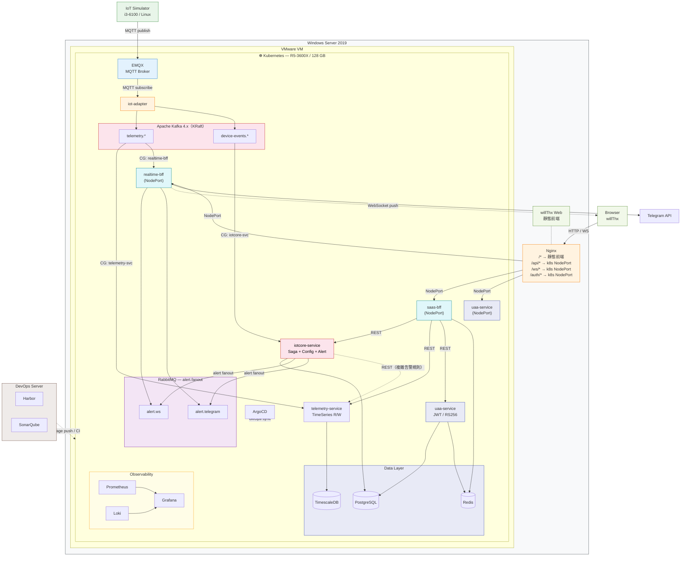

# PRD-003：系統架構與 Infra 設計

> 版本：v0.3
> 日期：2026-08-07
> 狀態：定稿

---

## 1. 架構拓樸圖



---

## 2. 訊息佇列分工

### 邊界原則

```
IoT 資料平面（裝置發出的原始資料） ──► Kafka
業務邏輯平面（系統產生的業務事件） ──► RabbitMQ
```

`iotcore-service` 是兩個平面的邊界：從 Kafka 消費 device event，處理完業務邏輯後將告警發至 RabbitMQ。

### 2.1 Kafka — IoT 資料平面

所有 IoT 原始資料統一進 Kafka，理由：
- **有序性**：同一機台的 device event（上料/下料）必須有序，Kafka partition key = machineId
- **可 replay**：Lot/Unit 狀態算錯時可從頭重跑事件
- **唯一事實來源**：板件追溯的所有歷史資料來自此

| Topic | 說明 | 生產者 | Consumer Group |
|-------|------|--------|---------------|
| `telemetry.{stationId}.{machineId}` | 感測器連續數值 | iot-adapter | telemetry-svc、realtime-bff |
| `device-events.{stationId}` | 上下料、停機、批號事件 | iot-adapter | iotcore-svc |

**Fan-out**：同一 topic 多個 Consumer Group 各自獨立讀取完整訊息，互不干擾。

### 2.2 RabbitMQ — 業務邏輯平面

alert 評估後的業務派發，不承接 IoT 原始資料。

```
iotcore-service
    └──► Exchange: alert.fanout
              ├──► Queue: alert.ws       → realtime-bff（WebSocket push）
              └──► Queue: alert.telegram → realtime-bff（Telegram API）
```

選用 RabbitMQ 的理由：Fanout Exchange 廣播、Dead Letter Queue（Telegram 失敗重試）、per-message TTL。

---

## 3. 微服務設計

### 3.1 服務清單（6 個 + Nginx）

| 服務 | 層級 | 核心職責 |
|------|------|---------|
| `iot-adapter` | Ingestion | MQTT subscribe → 正規化 → Kafka publish |
| `iotcore-service` | Core | Saga 協調器（Lot/Unit 狀態機）+ 告警評估 + IoT 設定 CRUD |
| `telemetry-service` | Core | Kafka consumer → TimescaleDB 寫入（Write path）+ 時序資料查詢 REST API（Read path） |
| `uaa-service` | Platform | JWT 發放（RS256）、登入/登出、RBAC 驗證 |
| `saas-bff` | BFF | Web 後台 REST 聚合（呼叫 iotcore + telemetry + uaa） |
| `realtime-bff` | BFF | WebSocket push（telemetry + alert）+ Telegram 通知 |
| Nginx Ingress | Entry | 路由、TLS termination、靜態檔案 |

### 3.2 BFF 設計原則

- **BFF 不連接任何資料庫**，只能：
  - 呼叫後端 Core 服務的 REST API
  - 讀寫 Redis（快取、session）
- **saas-bff**：為 Web Admin UI 量身聚合，減少前端多次 API 呼叫
- **realtime-bff**：為即時 Dashboard 服務，訂閱 Kafka + RabbitMQ，維護 WebSocket 連線

```
saas-bff 範例 — 批號查詢頁面（一次回傳前端所需全部資料）：
  GET /bff/lots/{lotId}
    → iotcore-service: GET /lots/{lotId}           （批號基本資訊）
    → iotcore-service: GET /lots/{lotId}/units      （Unit 清單）
    → telemetry-service: GET /telemetry/lot/{lotId} （各站感測摘要）
    → 聚合後一次回傳
```

### 3.3 telemetry-service 詳細設計

`telemetry-service` 有兩條獨立的路徑，職責嚴格分開：

```
Write path：Kafka telemetry.* ──► telemetry-service ──► TimescaleDB
Read path： REST API          ◄── 其他服務查詢

Write path 特性：高吞吐、批次寫入（batch insert）、不阻塞 Read path
Read path 端點（範例）：
  GET /telemetry?machineId=M05&from=10:24:00&to=10:34:00   歷史時序（板件追溯用）
  GET /telemetry/summary?lotId=Lot-007&station=S03         批號各站感測摘要
  GET /telemetry/recent?machineId=M05&minutes=5            近期資料（複雜告警規則用）
```

### 3.4 各服務取得 Telemetry 的方式

| 場景 | 取得方 | 方式 | 理由 |
|------|--------|------|------|
| Dashboard 即時折線圖 | realtime-bff | **Kafka 直接訂閱** | 低延遲，不需落地再查 |
| 板件追溯展開感測數值 | saas-bff | **REST → telemetry-service** | 需要歷史時段的完整時序 |
| 歷史告警上下文（前後 5 分鐘）| saas-bff | **REST → telemetry-service** | 同上 |
| 批號感測摘要 | saas-bff | **REST → telemetry-service** | 需要聚合統計（avg/max/min）|
| 告警規則評估（單次閾值超標）| iotcore-service | **event payload 本身帶數值** | 不需查 telemetry |
| 告警規則評估（連續 N 次超標）| iotcore-service | **REST → telemetry-service** | 需要近期 N 筆資料才能判斷 |

**重點**：`iotcore-service` 呼叫 `telemetry-service` 是**例外情況**（複雜告警規則），不是常態。大多數 device event 的 payload 本身就包含觸發告警所需的數值，iotcore 直接評估即可。

### 3.5 saas-bff 聚合範例

```
GET /bff/units/{unitSerial}   （板件追溯頁）

saas-bff 並行呼叫：
  ├── iotcore-service  GET /units/{unitSerial}/stations
  │     → 每站：進出站時間、機台、操作員、AOI 判定、複判記錄
  │
  └── telemetry-service  GET /telemetry?machineId=M05&from=10:24&to=10:34
        → 回流焊期間溫度時序（for 展開感測數據）

聚合後一次回傳前端，前端不需打兩支 API
```

### 3.6 iotcore-service 詳細設計

`iotcore-service` 是系統最重的服務，承擔四個職責：

**A. Kafka Consumer（device-events）**
```
收到 device event
  → Idempotency check（processed_events table）
  → Lot / Unit Saga 狀態轉換
  → 告警規則評估
      → 單次閾值：直接用 event payload 數值判斷
      → 複雜規則：REST 呼叫 telemetry-service 查近期資料
  → 寫 outbox（待發訊息）
  以上全在同一個 @Transactional
```

**B. Saga 狀態機**（見第 4 節詳細設計）

**C. REST API（供 saas-bff 呼叫）**
- 站點 / 機台 / IoT 元件 CRUD（設定業務域與 Saga 同屬 iotcore）
- Lot / Unit 查詢、板件追溯（不含 telemetry，telemetry 由 saas-bff 另行聚合）
- 告警規則 CRUD
- 通知設定 CRUD（Telegram Bot Token / Channel ID，與告警規則同一業務域）

**D. 對外依賴（例外情況）**
- 複雜告警規則評估時 REST 呼叫 `telemetry-service /telemetry/recent`

---

## 4. Saga 設計

### 4.1 實作組合

自行實作 Saga，採用業界標準三件組：

| Pattern | 解決的問題 |
|---------|-----------|
| **State Machine** | 顯式管理 Lot/Unit 生命週期狀態 |
| **Outbox Pattern** | 確保 DB 狀態更新與訊息發佈的原子性 |
| **Idempotency Key** | 防止 Kafka 重複消費同一事件造成重複轉換 |

### 4.2 Lot 狀態機

```
                    LOT_PAUSE
         ┌──────────────────────────┐
         │                          ▼
PENDING ─► ACTIVE ◄─ LOT_RESUME ─ PAUSED
              │
          LOT_CLOSE
              │
              ▼
         COMPLETING ──► COMPLETED

事件對應：
  LOT_START    PENDING    → ACTIVE
  LOT_PAUSE    ACTIVE     → PAUSED    （機台異常停機）
  LOT_RESUME   PAUSED     → ACTIVE    （復工）
  LOT_CLOSE    ACTIVE     → COMPLETING → COMPLETED
```

### 4.3 Unit 狀態機

```
PENDING
  → [UNIT_LOAD @ S01] → S01_IN_PROGRESS
  → [UNIT_UNLOAD @ S01] → S01_DONE
  → [UNIT_LOAD @ S02] → S02_IN_PROGRESS
  → [UNIT_UNLOAD @ S02 / AOI_PASS] → S02_DONE
  → [UNIT_UNLOAD @ S02 / AOI_FAIL] → PENDING_REVIEW
      → [REVIEW_PASS] → S02_DONE
      → [REVIEW_FAIL] → REJECTED
  → [UNIT_LOAD @ S03] → S03_IN_PROGRESS
  → ...
  → [UNIT_UNLOAD @ S04 / TEST_PASS] → COMPLETED
  → [UNIT_UNLOAD @ S04 / TEST_FAIL] → REJECTED
```

### 4.4 Outbox Pattern

解決「狀態更新」與「訊息發布」的原子性問題：

```
傳統做法（有問題）：
  1. UPDATE lot_sagas → DB commit ✅
  2. kafkaTemplate.send() → 崩潰 ❌  狀態改了但訊息沒發

Outbox 做法：
  @Transactional（同一 DB 交易）
  1. UPDATE lot_sagas（狀態轉換）
  2. INSERT INTO outbox（payload, topic, published=false）
  3. INSERT INTO processed_events（event_id）
  ↑ 全部一起 commit 或 rollback

  OutboxPublisher（獨立排程 or Debezium CDC）：
  4. SELECT * FROM outbox WHERE published = false
  5. Kafka / RabbitMQ publish
  6. UPDATE outbox SET published = true
```

> Demo 階段：`@Scheduled` 輪詢 outbox table（每 500ms）
> 正式環境：Debezium CDC 監聽 PostgreSQL WAL，零延遲觸發

### 4.5 Idempotency

```java
@Transactional
public void handle(DeviceEvent event) {
    // 1. 冪等性檢查
    if (processedEventRepo.existsById(event.getEventId())) return;

    // 2. 載入 Saga 狀態（樂觀鎖）
    LotSaga saga = lotSagaRepo.findByLotId(event.getLotId());

    // 3. 狀態轉換
    SagaTransition next = stateMachine.transition(saga.getState(), event);
    saga.apply(next);            // state + version++

    // 4. 告警評估
    List<Alert> alerts = alertEvaluator.evaluate(event, next);

    // 5. 寫 outbox
    outboxRepo.saveAll(buildMessages(next, alerts));

    // 6. 標記已處理
    processedEventRepo.save(new ProcessedEvent(event.getEventId()));

    // 全部在同一個 @Transactional
}
```

---

## 5. UAA Service 設計

自行實作，採 RS256 非對稱金鑰：

```
uaa-service 持有 private key → 簽發 JWT
其他服務持有 public key      → 本地驗證（不需打 uaa）
```

### API 端點

| 端點 | 說明 |
|------|------|
| `POST /auth/login` | 帳密驗證 → 回傳 access_token + refresh_token |
| `POST /auth/refresh` | refresh_token → 新 access_token |
| `POST /auth/logout` | refresh_token 加入 Redis 黑名單 |
| `GET  /auth/me` | 解析 token → 回傳使用者資訊 |
| `GET  /auth/jwks` | 公開 public key（供其他服務取得） |

### Token 設計

```
access_token：短效（15 分鐘），JWT payload 含 userId、role、tenantId
refresh_token：長效（7 天），存 Redis（可主動撤銷）
登出：refresh_token 加入 Redis blacklist
```

### RBAC 驗證方式

```
Browser → saas-bff（帶 Bearer token）
  → saas-bff 用 public key 本地驗證簽章 + 過期時間
  → 解析 role，決定是否有權限呼叫下游服務
  → 呼叫 iotcore-service / telemetry-service（internal call，不再驗 token）
```

---

## 6. 資料庫設計

### 6.1 PostgreSQL（主資料庫）

| Schema 群 | 表格 | 所屬服務 |
|-----------|------|---------|
| IoT 設定 | stations, machines, iot_components | iotcore-service |
| 生產資料 | lots, units, unit_station_records | iotcore-service |
| Saga | lot_sagas, unit_sagas, processed_events, outbox | iotcore-service |
| 告警 | alert_rules, alert_events, alert_ack | iotcore-service |
| Audit | audit_logs（複判記錄） | iotcore-service |
| 使用者 | users, refresh_tokens | uaa-service |

> uaa-service 獨立 schema，其餘共用同一 PostgreSQL 實例

### 6.2 TimescaleDB（獨立實例）

- 儲存所有 telemetry 時序資料
- Hypertable：`(time, machine_id)` 為主鍵
- Continuous Aggregate：預聚合每分鐘 avg/max/min，加速 Dashboard 查詢
- Retention policy：原始資料保留 30 天，聚合資料保留 1 年

### 6.3 Redis

| 用途 | Key 設計 | TTL |
|------|---------|-----|
| Dashboard 統計快取 | `cache:dashboard:{tenantId}` | 30s |
| WebSocket session | `ws:session:{clientId}` | 連線存活期 |
| Refresh token | `auth:refresh:{token}` | 7 天 |
| Token 黑名單 | `auth:blacklist:{token}` | 至 token 到期 |

---

## 7. 技術選型總覽

| 類別 | 技術 | 版本 |
|------|------|------|
| Container Orchestration | Kubernetes（kubeadm 或 k3s） | 1.29+ |
| VM Host | VMware on Windows Server 2019 | — |
| Reverse Proxy（外層）| Nginx on Windows Server | — |
| MQTT Broker | EMQX | 5.x |
| Message Queue（高吞吐）| Apache Kafka（KRaft，無 Zookeeper） | **4.x** |
| Message Queue（業務派發）| RabbitMQ | 3.13+ |
| 時序資料庫 | TimescaleDB | 2.x（on PostgreSQL 16） |
| 關聯資料庫 | PostgreSQL | 16 |
| Cache | Redis | 7.x |
| Java Framework | Spring Boot | 3.x |
| Reverse Proxy / Ingress | Nginx Ingress Controller | — |
| Container Registry | Harbor（DevOps server） | 2.x |
| GitOps CD | ArgoCD（Prod server） | 2.x |
| Code Quality | SonarQube（DevOps server） | — |
| Metrics | Prometheus | 2.x |
| Log Aggregation | Loki + Promtail | 3.x |
| Visualization | Grafana | 10.x |

---

## 8. CI/CD 流程

```
Git Push
  │
  ▼ CI（DevOps Server）
  ├── SonarQube 靜態分析（Quality Gate）
  ├── Unit / Integration Test
  ├── Docker Build
  └── Push Image → Harbor
  │
  ▼ Merge to main
  │
  ▼ ArgoCD（Prod Server — k8s）
  ├── 監聽 Helm Chart / Kustomize 變更
  └── Auto sync → Rolling Deploy
```

---

## 9. Observability

```
Spring Boot Actuator /metrics
  └──► Prometheus（scrape）
            └──► Grafana

k8s Pod stdout logs
  └──► Promtail
            └──► Loki
                    └──► Grafana
```

**關鍵監控指標：**

| 指標 | 意義 |
|------|------|
| Kafka consumer lag（iotcore-svc） | device event 處理是否跟得上 |
| Kafka consumer lag（telemetry-svc）| telemetry 寫入是否跟得上 |
| TimescaleDB write TPS | 百萬流量壓測時的寫入速率 |
| outbox 未發訊息數量 | Outbox publisher 是否健康 |
| WebSocket 連線數 | realtime-bff 負載 |
| Alert pipeline 端對端延遲 | device event → Telegram 推播時間 |
| JWT 驗證失敗率 | 安全監控 |

---

## 10. K8s 資源規劃（單節點概估）

| 元件 | CPU Request | Memory Request |
|------|------------|---------------|
| EMQX | 1.0 | 2 Gi |
| Kafka 4.x（KRaft，無 Zookeeper） | 2.0 | 4 Gi |
| RabbitMQ | 0.5 | 1 Gi |
| TimescaleDB | 2.0 | 8 Gi |
| PostgreSQL | 1.0 | 4 Gi |
| Redis | 0.5 | 1 Gi |
| iot-adapter | 1.0 | 1 Gi |
| iotcore-service | 1.5 | 2 Gi |
| telemetry-service | 1.0 | 1 Gi |
| uaa-service | 0.5 | 512 Mi |
| saas-bff | 0.5 | 512 Mi |
| realtime-bff | 1.0 | 1 Gi |
| Prometheus + Loki + Grafana | 1.5 | 4 Gi |
| ArgoCD | 0.5 | 1 Gi |
| Nginx Ingress | 0.5 | 512 Mi |
| **合計** | **~15.5 CPU** | **~32 Gi** |

> R5-3600X 6C/12T、128 GB RAM，記憶體充裕。
> CPU 超訂依賴 Burst，密集壓測時 Kafka + TimescaleDB 為主要競爭者，建議各自設 CPU limit。
