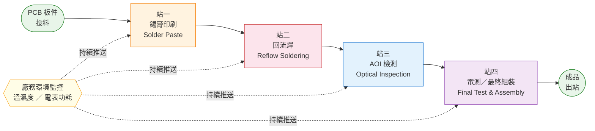

# PRD-004：IoT 資料設計

> 版本：v1.1
> 日期：2026-08-14
> 狀態：定稿

本文件定義 IoT 資料平面的業務需求：**要收集什麼資料、從哪些設備收集、裝置端以什麼格式上報**。iot-adapter 正規化後的內部 Kafka 格式、資料庫 Schema 等實作細節由對應 Spec 定義。

---

## 1. 業務目的

willThx 平台從生產現場收集兩類 IoT 資料，支撐三個核心業務場景：

| 資料類型 | 說明 | 支撐的業務場景 |
|---------|------|--------------|
| **Telemetry** | 設備連續感測數值（高頻、時序） | Dashboard 即時監控、製程異常告警、板件履歷感測摘要 |
| **Event** | 製程離散事件（板件上下料、批號、停機） | Lot/Unit 狀態追蹤、板件履歷追溯、良率統計 |

---

## 2. 製程全覽



每片板件依序流過四站，每站形成固定節奏：

```
操作員上料 → [UNIT_LOADED Event]
    ↓
設備執行製程（持續推送 Telemetry）
    ↓
操作員下料 → [UNIT_UNLOADED Event]
    ↓
（人工間隔）→ 進入下一站
```

廠務環境感測器獨立於四站之外，全程持續推送廠區環境資料。

---

## 3. 資料階層

```
Tenant（工廠）
 └── Station（製程站點）
      ├── IoT Component（站點層級，如廠務環境感測器）
      └── Machine（機台）
           └── IoT Component（機台層級，如刮刀壓力感測器）
```

**IoT Component** 是資料收集的最小單位，每個元件定義：
- 量測的物理量與單位
- 資料類型（Telemetry / Event）
- 上報頻率（固定週期 或 事件驅動）

---

## 4. 各站設定清單

### 4.1 站點總覽

| stationId | 站點名稱 | 機台數 | machineId 範圍 | Telemetry 元件規格 | 備註 |
|-----------|---------|-------|--------------|-------------------|------|
| S01 | 錫膏印刷 | 10 | S01-M01 ~ S01-M10 | 3 種元件 × 10 台 | 各台獨立上報 |
| S02 | 回流焊 | 10 | S02-M01 ~ S02-M10 | 5 種元件 × 10 台 | 各台獨立上報 |
| S03 | AOI 光學檢測 | 10 | S03-M01 ~ S03-M10 | 無（結果走 Event） | 每板一筆 AOI_RESULT |
| S04 | 電測／最終組裝 | 10 | S04-M01 ~ S04-M10 | 1 種元件 × 10 台 | 扭力每鎖點觸發 |
| S05 | 廠務環境 | 無機台 | ENV | 3 種元件（站點層級） | 無機台，掛站點下 |

---

### 4.2 S01 — 錫膏印刷

**機台：** 印刷機-01 ~ 印刷機-10（S01-M01 ~ S01-M10），共 10 台

每台印刷機各自掛載以下三個 Telemetry 元件，獨立上報：

| componentCode | 量測物理量 | 單位 | 上報頻率 | 業務用途 |
|--------------|----------|------|---------|---------|
| `SP-PRESSURE` | 刮刀壓力 | kgf | 1s | 壓力異常告警；影響錫膏分佈均勻性 |
| `SP-THICKNESS` | 錫膏印刷厚度 | mm | 1s | 厚度超標告警；直接影響後續焊接品質 |
| `SP-SPEED` | 刮刀移動速度 | mm/s | 1s | 速度過快導致印刷不均 |

**製程事件（Event）：**

| eventType | 觸發時機 |
|-----------|---------|
| `UNIT_LOADED` | 操作員將板件放上印刷機 |
| `UNIT_UNLOADED` | 操作員取下板件 |
| `LOT_STARTED` | 批號開始投料 |
| `LOT_CLOSED` | 批號全數完成 |
| `MACHINE_STOPPED` | 換料停機 / 故障 |
| `MACHINE_RESUMED` | 復工 |

---

### 4.3 S02 — 回流焊

**機台：** 回焊爐-01 ~ 回焊爐-10（S02-M01 ~ S02-M10），共 10 台

回焊爐有四個溫區，各自獨立上報溫度，加上傳送帶速度，共五個 Telemetry 元件：

| componentCode | 量測物理量 | 單位 | 上報頻率 | 業務用途 |
|--------------|----------|------|---------|---------|
| `RF-TEMP-PREHEAT` | 預熱區溫度 | °C | 2s | 溫度曲線監控，各溫區超標即告警 |
| `RF-TEMP-SOAK` | 活化區溫度 | °C | 2s | 同上 |
| `RF-TEMP-REFLOW` | 回流區溫度 | °C | 2s | 核心焊接溫區，管控最嚴格 |
| `RF-TEMP-COOL` | 冷卻區溫度 | °C | 2s | 冷卻過快導致焊點龜裂 |
| `RF-BELT-SPEED` | 傳送帶速度 | cm/min | 5s | 影響板件在各溫區的停留時間 |

**製程事件（Event）：**

| eventType | 觸發時機 |
|-----------|---------|
| `UNIT_LOADED` | 板件送入爐體 |
| `UNIT_UNLOADED` | 板件出爐 |
| `LOT_STARTED` | 批號開始 |
| `LOT_CLOSED` | 批號結束 |
| `MACHINE_STOPPED` | 異常停爐 |
| `MACHINE_RESUMED` | 復工 |

---

### 4.4 S03 — AOI 光學檢測

**機台：** AOI 機-01 ~ AOI 機-10（S03-M01 ~ S03-M10），共 10 台

AOI 為焊後全自動光學檢測，每片板件完成掃描後輸出一筆判定結果。檢測過程無連續感測數值，**不設 Telemetry 元件**，所有輸出均以 Event 表達。

**製程事件（Event）：**

| eventType | 觸發時機 | 關鍵欄位 |
|-----------|---------|---------|
| `UNIT_LOADED` | 板件進入 AOI 機 | serial、lot、op |
| `UNIT_UNLOADED` | 板件離開 AOI 機 | serial、lot、op |
| `AOI_RESULT` | 每板檢測完成後輸出 | serial、result（PASS/FAIL）、dcode（缺陷碼）、dloc（缺陷位置） |

> AOI 複判（人員推翻機器判定）由操作員透過 Web UI 操作，走 REST API，不經 MQTT。

---

### 4.5 S04 — 電測／最終組裝

**機台：** 電測台-01 ~ 電測台-10（S04-M01 ~ S04-M10），共 10 台

功能電測結果以 Event 表達；螺絲鎖附的扭力值以 Telemetry 表達（每鎖點觸發一次）：

| componentCode | 量測物理量 | 單位 | 上報頻率 | 業務用途 |
|--------------|----------|------|---------|---------|
| `FA-TORQUE` | 鎖點扭力 | N·m | 每鎖點觸發 | 扭力超標或不足告警，影響組裝可靠性 |

**製程事件（Event）：**

| eventType | 觸發時機 | 關鍵欄位 |
|-----------|---------|---------|
| `UNIT_LOADED` | 板件上電測台 | serial、lot、op |
| `UNIT_UNLOADED` | 板件出站（成品） | serial、lot、op |
| `FINAL_TEST_RESULT` | 功能電測完成 | serial、result（PASS/FAIL） |
| `LOT_CLOSED` | 批號全數出站 | lot、op、reason |

---

### 4.6 S05 — 廠務環境

無機台，感測器直接掛站點下，持續監控廠區生產環境是否符合規範：

| componentCode | 量測物理量 | 單位 | 上報頻率 | 業務用途 |
|--------------|----------|------|---------|---------|
| `ENV-TEMP` | 廠區溫度 | °C | 30s | ESD 敏感區域環境管控 |
| `ENV-HUMIDITY` | 廠區濕度 | % | 30s | 濕度過高影響錫膏活性與板件靜電 |
| `ENV-POWER` | 電表功耗 | kW | 30s | 產線能耗監控，異常耗電即時告警 |

---

### 4.7 IoT 硬體選型對應

依設備類型分三類，決定 MQTT 發布方式：

| 類型 | 說明 | 代表硬體 | MQTT 發布端 |
|------|------|---------|-----------|
| **Type A** | MCU 直發型 | ESP32 + 感測器模組 | ESP32 firmware 直接 publish |
| **Type B** | 工業控制器 + Gateway | PLC / Modbus 感測器 + Raspberry Pi | Gateway 讀取工業協議後轉發 MQTT |
| **Type C** | 封閉系統 + Gateway | AOI 機、ICT 電測機 + Raspberry Pi | Gateway 解析私有協議後發 MQTT Event |

**各站元件硬體對應：**

| 站點 | 元件 | 硬體 | 類型 | 原生協議 |
|------|------|------|------|---------|
| S01 | SP-PRESSURE（刮刀壓力）| Load Cell + HX711 + **ESP32** | A | SPI → ESP32 直發 |
| S01 | SP-THICKNESS（錫膏厚度）| Keyence IL 雷射位移 + **ESP32 UART** | A | UART ASCII → ESP32 直發 |
| S01 | SP-SPEED（刮刀速度）| 伺服編碼器 + **ESP32 pulse count** | A | GPIO 脈波 → ESP32 計算後直發 |
| S01 | 製程事件 | **HMI 工控機**（操作員掃碼觸發）| — | 工控機軟體直發 MQTT Event |
| S02 | RF-TEMP-\*（4 溫區）| K 型熱電偶 × 4 + MAX31855 + **ESP32** | A | SPI → ESP32 分 4 topic 直發 |
| S02 | RF-BELT-SPEED（帶速）| 編碼器 + **ESP32** | A | GPIO 脈波 → ESP32 直發 |
| S02 | 製程事件 | 回焊爐 PLC + **Modbus→Raspberry Pi Gateway** | B | Modbus RTU → Gateway 轉發 |
| S03 | AOI_RESULT | Omron VT-S730 + **Ethernet→Raspberry Pi Gateway** | C | 私有 TCP → Gateway 解析後發 Event |
| S03 | 上下料事件 | **HMI 工控機** | — | 工控機軟體直發 MQTT Event |
| S04 | FA-TORQUE（扭力）| Atlas Copco 電動扭力工具 + **RS232→ESP32** | A | RS232 ASCII → ESP32 解析後直發 |
| S04 | FINAL_TEST_RESULT | ICT 測試機 + **TCP→Raspberry Pi Gateway** | C | TCP 結果字串 → Gateway 解析後發 Event |
| S04 | 上下料事件 | **HMI 工控機** | — | 工控機軟體直發 MQTT Event |
| S05 | ENV-TEMP / ENV-HUMIDITY | SHT31 + **ESP32** | A | I2C → ESP32 直發 |
| S05 | ENV-POWER（電表）| Schneider PM5560 + **Modbus TCP→Raspberry Pi** | B | Modbus TCP → Gateway 轉發 |

> 所有硬體最終輸出至 EMQX 的格式均須符合第 5 節規範。硬體內部協議轉換由各裝置 Gateway 負責，不在本平台範疇。
> Demo 壓測階段以 **Python Mock Simulator** 統一模擬上述三種類型的 MQTT 發布行為，詳見 `doc/mock-simulator.md`。

---

## 5. 裝置端資料格式（MQTT）

### 5.1 設計原則

- **Topic 攜帶元數據**：裝置身份（stationId、machineId、componentCode）由 Topic 表達，payload 不重複
- **輕量 payload**：適合 ESP32 / STM32 等資源受限裝置，短鍵名節省傳輸量
- **Unix 毫秒時間戳**：裝置端採樣時記錄，避免網路延遲影響時序還原
- **一元件一訊息**：每筆 Telemetry 只含一個量測值，不合併多個感測器，利於各元件獨立頻率上報

### 5.2 MQTT Topic 格式

**Telemetry（含 componentCode）：**
```
willthx/{tenantId}/telemetry/{stationId}/{machineId}/{componentCode}
```

**Event（不含 componentCode，事件類型在 payload 裡）：**
```
willthx/{tenantId}/event/{stationId}/{machineId}
```

| 欄位 | 說明 | 範例 |
|------|------|------|
| `tenantId` | 租戶識別碼，裝置燒錄時配置 | `tenant-001` |
| `stationId` | 站點代碼 | `S01` |
| `machineId` | 機台代碼；廠務環境填 `ENV` | `S01-M01`、`ENV` |
| `componentCode` | 元件代碼（Telemetry 專用） | `SP-PRESSURE` |

**Topic 範例：**
```
willthx/tenant-001/telemetry/S01/S01-M01/SP-PRESSURE    ← 印刷機-01 刮刀壓力
willthx/tenant-001/telemetry/S01/S01-M01/SP-THICKNESS   ← 印刷機-01 錫膏厚度
willthx/tenant-001/telemetry/S02/S02-M01/RF-TEMP-REFLOW ← 回焊爐-01 回流區溫度
willthx/tenant-001/telemetry/S05/ENV/ENV-HUMIDITY       ← 廠務環境濕度
willthx/tenant-001/event/S01/S01-M01                    ← 印刷機-01 製程事件
willthx/tenant-001/event/S03/S03-M01                    ← AOI 機-01 製程事件
```

---

### 5.3 Telemetry Payload

每筆感測值獨立一條訊息，兩個欄位：

```json
{ "ts": 1723622580123, "v": 9.8 }
```

| 欄位 | 型別 | 說明 |
|------|------|------|
| `ts` | Number | Unix 時間戳（毫秒），裝置採樣時間 |
| `v` | Number | 感測數值（單位由 componentCode 定義，不帶入 payload） |

**各元件 payload 範例：**

```json
// SP-PRESSURE（刮刀壓力，正常範圍 8–12 kgf）
{ "ts": 1723622580000, "v": 9.8 }

// RF-TEMP-REFLOW（回流區溫度，正常範圍 240–260 °C）
{ "ts": 1723622582000, "v": 247.3 }

// ENV-HUMIDITY（廠區濕度，正常範圍 40–60 %）
{ "ts": 1723622610000, "v": 58.2 }

// FA-TORQUE（鎖點扭力，每鎖點觸發）
{ "ts": 1723622900000, "v": 0.45 }
```

---

### 5.4 Event Payload

製程事件 payload 隨 `type` 而異，共用 `ts`（毫秒時間戳）與 `type`（事件類型）兩個必填欄位。

**UNIT_LOADED / UNIT_UNLOADED**
```json
{
  "ts":     1723622580000,
  "type":   "UNIT_LOADED",
  "serial": "PCB-2026-00042",
  "lot":    "Lot-007",
  "op":     "OP-001"
}
```

**LOT_STARTED**
```json
{
  "ts":   1723622400000,
  "type": "LOT_STARTED",
  "lot":  "Lot-007",
  "pn":   "PCB-A100",
  "qty":  20,
  "op":   "OP-001"
}
```

**LOT_CLOSED**
```json
{
  "ts":     1723630000000,
  "type":   "LOT_CLOSED",
  "lot":    "Lot-007",
  "op":     "OP-001",
  "reason": "COMPLETED"
}
```

**MACHINE_STOPPED / MACHINE_RESUMED**
```json
{
  "ts":     1723625000000,
  "type":   "MACHINE_STOPPED",
  "reason": "MATERIAL_CHANGE",
  "op":     "OP-001"
}
```

**AOI_RESULT**
```json
{
  "ts":     1723624000000,
  "type":   "AOI_RESULT",
  "serial": "PCB-2026-00042",
  "lot":    "Lot-007",
  "result": "FAIL",
  "dcode":  "SOLDER_BRIDGE",
  "dloc":   "U12-PIN3"
}
```

**FINAL_TEST_RESULT**
```json
{
  "ts":     1723626000000,
  "type":   "FINAL_TEST_RESULT",
  "serial": "PCB-2026-00042",
  "lot":    "Lot-007",
  "result": "PASS"
}
```

---

## 6. 資料特性摘要

### 6.1 Telemetry 上報量估算（單工廠，40 台機器，全產線運作）

**正常模式：**

| 站點 | 計算式 | msg/s | msg/hr |
|------|-------|-------|--------|
| S01 錫膏印刷 | 3 元件 × 10 台 × 1/1s | **30** | **108,000** |
| S02 回流焊（4 溫區）| 4 元件 × 10 台 × 1/2s | **20** | **72,000** |
| S02 回流焊（帶速）| 1 元件 × 10 台 × 1/5s | **2** | **7,200** |
| S03 AOI | 無 Telemetry | 0 | 0 |
| S04 電測（扭力）| 1 元件 × 10 台，事件驅動 | ≈ **0.7** | ≈ **2,400** |
| S05 廠務環境 | 3 元件 × 1/30s | ≈ **0.1** | **360** |
| **合計** | | **≈ 52.8 msg/s** | **≈ 190,000 msg/hr** |

> 正常模式每天約 **456 萬筆**，TimescaleDB 壓力極低。

**Mock 壓測模式（壓縮上報間隔）：**

| 壓縮倍率 | 等效間隔 | msg/s | msg/hr | 達到百萬/hr |
|---------|---------|-------|--------|-----------|
| 10x | 100ms | ~528 | ~190 萬 | ✅ |
| 50x | 20ms | ~2,640 | ~950 萬 | ✅ |
| 100x | 10ms | ~5,280 | ~1,900 萬 | ✅ |

> **10x 壓縮即超過百萬/hr**，為 Demo 壓測的建議起點。

**TimescaleDB 寫入量估算（壓縮後約 10:1）：**

| 模式 | msg/hr | 原始 | 壓縮後 |
|------|--------|------|-------|
| 正常 | 19 萬 | ~11 MB/hr | ~1.1 MB/hr |
| 壓測 10x | 190 萬 | ~110 MB/hr | ~11 MB/hr |
| 壓測 100x | 1,900 萬 | ~1.1 GB/hr | ~110 MB/hr |

### 6.2 資料特性對比

| 面向 | Telemetry | Event |
|------|-----------|-------|
| 頻率 | 固定週期，1s–30s | 低頻，人工或設備觸發 |
| 業務敏感性 | 低（單點數值漂移可接受） | 高（不可漏、不可重複） |
| 重播需求 | 否（已落時序資料庫） | 是（Saga 狀態機重建需從頭重播） |
| 保留需求 | 原始 30 天 + 聚合摘要 1 年 | 長期保留（板件追溯） |
